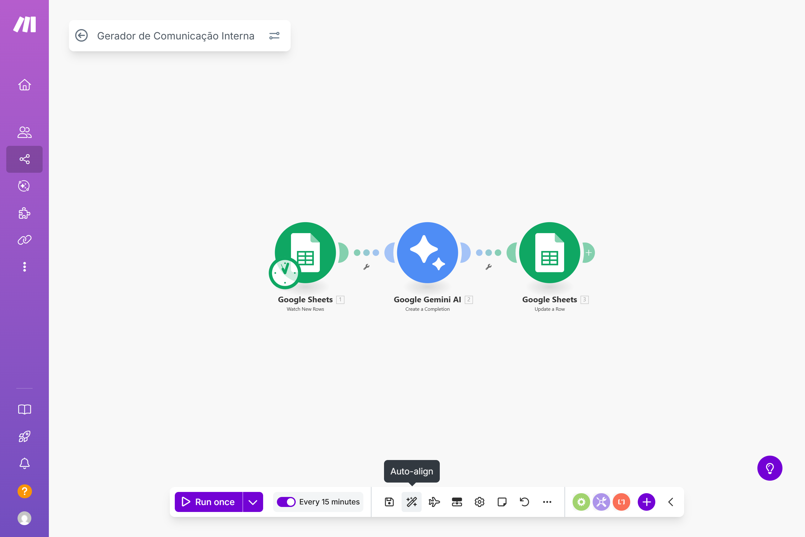
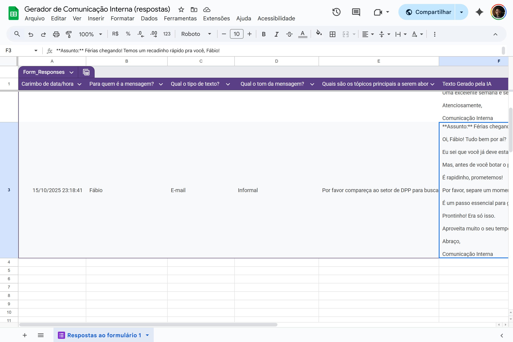
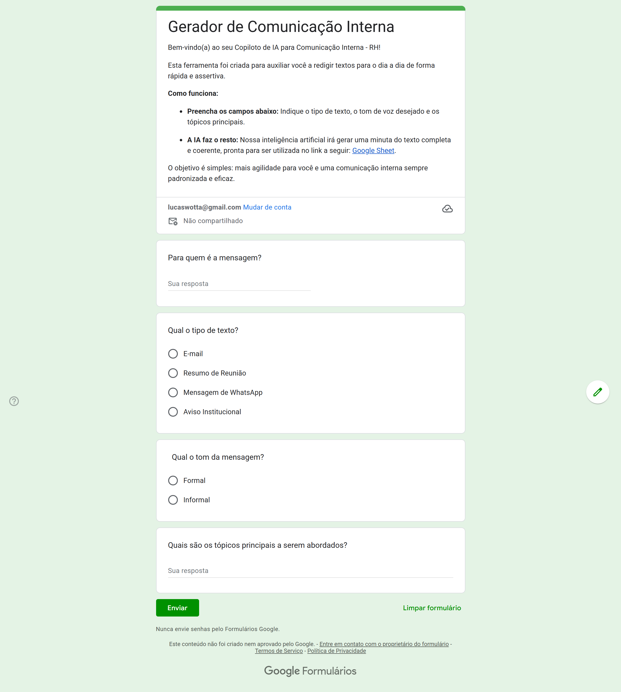

# Projeto: Copiloto de IA para Comunicação Interna

### Vídeo de Apresentação e Demonstração
*Assista ao vídeo abaixo para uma explicação completa e demonstração do protótipo em funcionamento.*

[Link Youtube Aqui - Pitch]

---

## 1. Visão Geral do Projeto
Este projeto, desenvolvido para a disciplina de Fundamentos da IA Generativa, consiste em um protótipo funcional de um assistente de IA para otimizar a criação de textos de comunicação interna. A solução foi criada utilizando uma abordagem low-code/no-code.

* Para uma análise técnica detalhada, consulte o arquivo [ANALISE_TEORICA.md](ANALISE_TEORICA.md).

## 2. Ferramentas Utilizadas
* **Entrada de Dados:** Google Forms
* **Banco de Dados/Log:** Google Sheets
* **Orquestração e Automação:** Make.com
* **Inteligência Artificial:** Google Gemini (Modelo Flash Latest)

## 3. Blueprint da Automação (Código-Fonte)
O arquivo `MAKE.blueprint.json`, incluído neste repositório, contém o "código-fonte" da automação. Este arquivo pode ser importado diretamente na plataforma Make.com para recriar e inspecionar o cenário completo do projeto.

## 4. Solução

### Fluxo da Automação no Make.com
*O diagrama abaixo mostra os 3 estágios da automação: o gatilho que monitora a planilha, o módulo de IA que gera o texto e a ação final que atualiza a planilha com o resultado.*

### Exemplo de Resultado na Planilha
*A imagem a seguir demonstra um resultado real, onde a última coluna foi preenchida automaticamente pela IA após o envio de uma solicitação pelo formulário.*

### Interface de Entrada de Dados (Google Forms)
*Esta é a interface simples que o usuário final (ex: colaborador do RH) utiliza para solicitar a criação de um texto.*

